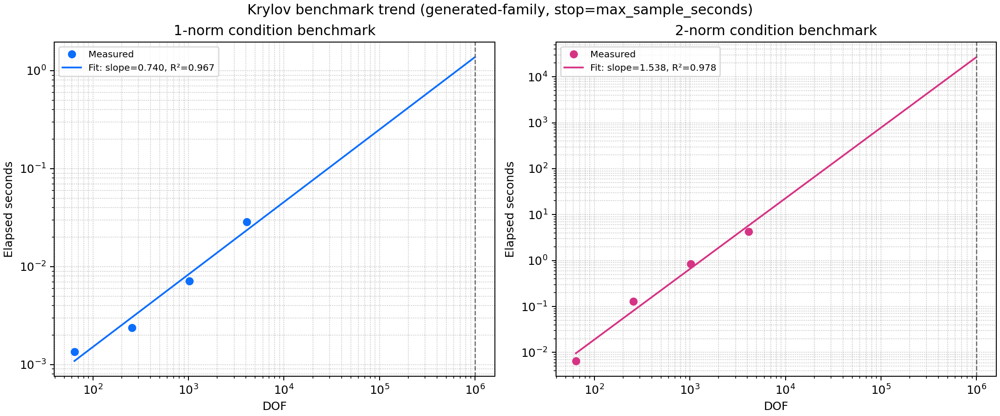

# Krylov Benchmark Report

**Date:** 2026-04-03

## Benchmark Setup

- Sampling strategy: generated-family
- Matrix family: anisotropic-poisson-2d
- Stop reason: max_sample_seconds
- Observed DOF values: 64, 256, 1024, 4096
- Target DOF for extrapolation: 1000000

## Measured Samples

| Input | DOF | NNZ | Norm | Time (s) | Cond. |
| --- | ---: | ---: | ---: | ---: | ---: |
| generated:anisotropic-poisson-2d:grid=8 | 64 | 288 | 1 | 0.001360 | 21.1064 |
| generated:anisotropic-poisson-2d:grid=16 | 256 | 1216 | 1 | 0.002373 | 30.4245 |
| generated:anisotropic-poisson-2d:grid=32 | 1024 | 4992 | 1 | 0.007136 | 32.8827 |
| generated:anisotropic-poisson-2d:grid=64 | 4096 | 20224 | 1 | 0.028743 | 32.9998 |
| generated:anisotropic-poisson-2d:grid=8 | 64 | 288 | 2 | 0.006523 | 16.3035 |
| generated:anisotropic-poisson-2d:grid=16 | 256 | 1216 | 2 | 0.129906 | 25.7205 |
| generated:anisotropic-poisson-2d:grid=32 | 1024 | 4992 | 2 | 0.843552 | 30.7031 |
| generated:anisotropic-poisson-2d:grid=64 | 4096 | 20224 | 2 | 4.260810 | 32.3764 |

## Fitted Results

| Norm | Samples | Slope | R² | Predicted time at target DOF |
| --- | ---: | ---: | ---: | ---: |
| 1-norm | 4 | 0.7397 | 0.9672 | 1.378506 s |
| 2-norm | 4 | 1.5377 | 0.9781 | 26974.429038 s |

## Correctness Validation

The benchmark report now carries correctness-validation cases alongside performance data. The table below mixes closed-form PDE-style references (for example Dirichlet Poisson operators) with exact dense-reference checks on moderate structured sparse systems such as anisotropic diffusion and coupled complex block matrices.

| Case | Estimator | Norm | DOF | Expected κ | Measured κ | Relative error |
| --- | --- | ---: | ---: | ---: | ---: | ---: |
| anisotropic_shifted_poisson_2d_6x6 | condest_1 | 1 | 36 | 16.0859 | 16.0859 | 0.000e+00 |
| anisotropic_shifted_poisson_2d_6x6 | condest_2 | 2 | 36 | 12.1554 | 12.1554 | 0.000e+00 |
| anisotropic_shifted_poisson_2d_6x6 | estimate_condest_2_krylov | 2 | 36 | 12.1554 | 12.1554 | 0.000e+00 |
| coupled_complex_diffusion_2d_6x6 | condest_1 | 1 | 72 | 38.4859 | 38.4859 | 1.846e-16 |
| coupled_complex_diffusion_2d_6x6 | condest_2 | 2 | 72 | 26.9681 | 26.9681 | 0.000e+00 |
| coupled_complex_diffusion_2d_6x6 | estimate_condest_1_krylov | 1 | 72 | 38.4859 | 38.4859 | 2.622e-14 |
| coupled_complex_diffusion_2d_6x6 | estimate_condest_2_krylov | 2 | 72 | 26.9681 | 26.9681 | 9.222e-16 |
| diagonal_1_to_128 | condest_1 | 1 | 128 | 128 | 128 | 0.000e+00 |
| diagonal_1_to_128 | condest_2 | 2 | 128 | 128 | 128 | 0.000e+00 |
| diagonal_1_to_128 | estimate_condest_1_krylov | 1 | 128 | 128 | 128 | 0.000e+00 |
| diagonal_1_to_128 | estimate_condest_2_krylov | 2 | 128 | 128 | 128 | 0.000e+00 |
| poisson_2d_dirichlet_8x8 | condest_2 | 2 | 64 | 32.1634 | 32.1634 | 2.209e-16 |
| poisson_2d_dirichlet_8x8 | estimate_condest_2_krylov | 2 | 64 | 32.1634 | 32.1634 | 0.000e+00 |

Maximum relative error across validation records: 2.622e-14

## Fitted Chart

