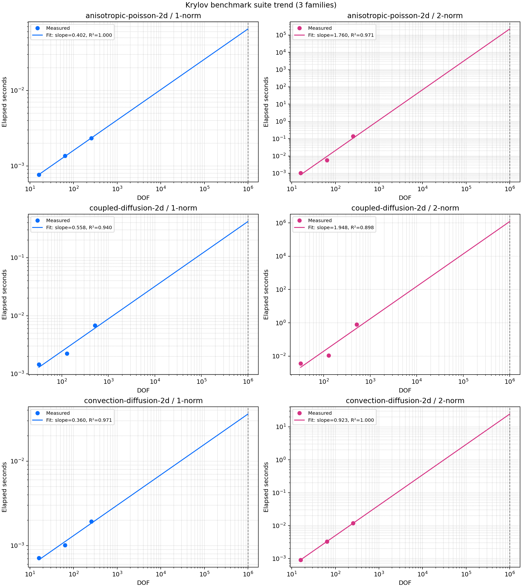

# Krylov Benchmark Suite Report

**Date:** 2026-04-03

## Benchmark Scope

- Family count: 3
- Families: anisotropic-poisson-2d, coupled-diffusion-2d, convection-diffusion-2d
- Target DOF for extrapolation: 1000000

## Cross-Family Summary

| Family | Norm | Samples | Slope | R² | Predicted time at target DOF |
| --- | ---: | ---: | ---: | ---: | ---: |
| anisotropic-poisson-2d | 1 | 3 | 0.4025 | 0.9996 | 0.065378 s |
| anisotropic-poisson-2d | 2 | 3 | 1.7596 | 0.9715 | 224587.701968 s |
| coupled-diffusion-2d | 1 | 3 | 0.5584 | 0.9395 | 0.418732 s |
| coupled-diffusion-2d | 2 | 3 | 1.9476 | 0.8981 | 1208434.283695 s |
| convection-diffusion-2d | 1 | 3 | 0.3599 | 0.9706 | 0.036088 s |
| convection-diffusion-2d | 2 | 3 | 0.9228 | 1.0000 | 24.418840 s |

## Family: anisotropic-poisson-2d

| Norm | Samples | Slope | R² | Predicted time at target DOF |
| --- | ---: | ---: | ---: | ---: |
| 1-norm | 3 | 0.4025 | 0.9996 | 0.065378 s |
| 2-norm | 3 | 1.7596 | 0.9715 | 224587.701968 s |

| Input | DOF | NNZ | Norm | Time (s) | Cond. |
| --- | ---: | ---: | ---: | ---: | ---: |
| generated:anisotropic-poisson-2d:grid=4 | 16 | 64 | 1 | 0.000763 | 9.91182 |
| generated:anisotropic-poisson-2d:grid=8 | 64 | 288 | 1 | 0.001358 | 21.1064 |
| generated:anisotropic-poisson-2d:grid=16 | 256 | 1216 | 1 | 0.002329 | 30.4245 |
| generated:anisotropic-poisson-2d:grid=4 | 16 | 64 | 2 | 0.001041 | 7.3832 |
| generated:anisotropic-poisson-2d:grid=8 | 64 | 288 | 2 | 0.005786 | 16.3035 |
| generated:anisotropic-poisson-2d:grid=16 | 256 | 1216 | 2 | 0.136793 | 25.7205 |

## Family: coupled-diffusion-2d

| Norm | Samples | Slope | R² | Predicted time at target DOF |
| --- | ---: | ---: | ---: | ---: |
| 1-norm | 3 | 0.5584 | 0.9395 | 0.418732 s |
| 2-norm | 3 | 1.9476 | 0.8981 | 1208434.283695 s |

| Input | DOF | NNZ | Norm | Time (s) | Cond. |
| --- | ---: | ---: | ---: | ---: | ---: |
| generated:coupled-diffusion-2d:grid=4 | 32 | 160 | 1 | 0.001449 | 20.859 |
| generated:coupled-diffusion-2d:grid=8 | 128 | 704 | 1 | 0.002236 | 57.1275 |
| generated:coupled-diffusion-2d:grid=16 | 512 | 2944 | 1 | 0.006815 | 121.875 |
| generated:coupled-diffusion-2d:grid=4 | 32 | 160 | 2 | 0.003600 | 14.7838 |
| generated:coupled-diffusion-2d:grid=8 | 128 | 704 | 2 | 0.011083 | 40.1129 |
| generated:coupled-diffusion-2d:grid=16 | 512 | 2944 | 2 | 0.796833 | 89.235 |

## Family: convection-diffusion-2d

| Norm | Samples | Slope | R² | Predicted time at target DOF |
| --- | ---: | ---: | ---: | ---: |
| 1-norm | 3 | 0.3599 | 0.9706 | 0.036088 s |
| 2-norm | 3 | 0.9228 | 1.0000 | 24.418840 s |

| Input | DOF | NNZ | Norm | Time (s) | Cond. |
| --- | ---: | ---: | ---: | ---: | ---: |
| generated:convection-diffusion-2d:grid=4 | 16 | 64 | 1 | 0.000713 | 12.73 |
| generated:convection-diffusion-2d:grid=8 | 64 | 288 | 1 | 0.001011 | 35.3979 |
| generated:convection-diffusion-2d:grid=16 | 256 | 1216 | 1 | 0.001935 | 78.107 |
| generated:convection-diffusion-2d:grid=4 | 16 | 64 | 2 | 0.000915 | 8.70823 |
| generated:convection-diffusion-2d:grid=8 | 64 | 288 | 2 | 0.003309 | 24.6718 |
| generated:convection-diffusion-2d:grid=16 | 256 | 1216 | 2 | 0.011812 | 56.5435 |

## Correctness Validation

The suite report reuses the shared correctness-validation records so each family trend is interpreted against the same 1-norm and 2-norm reference baseline.

| Case | Estimator | Norm | DOF | Expected κ | Measured κ | Relative error |
| --- | --- | ---: | ---: | ---: | ---: | ---: |
| anisotropic_shifted_poisson_2d_6x6 | condest_1 | 1 | 36 | 16.0859 | 16.0859 | 0.000e+00 |
| anisotropic_shifted_poisson_2d_6x6 | condest_2 | 2 | 36 | 12.1554 | 12.1554 | 0.000e+00 |
| anisotropic_shifted_poisson_2d_6x6 | estimate_condest_2_krylov | 2 | 36 | 12.1554 | 12.1554 | 2.923e-16 |
| convection_diffusion_2d_6x6 | condest_1 | 1 | 36 | 23.6733 | 23.6733 | 0.000e+00 |
| convection_diffusion_2d_6x6 | condest_2 | 2 | 36 | 16.2491 | 16.2491 | 0.000e+00 |
| convection_diffusion_2d_6x6 | estimate_condest_1_krylov | 1 | 36 | 23.6733 | 23.6733 | 1.501e-16 |
| convection_diffusion_2d_6x6 | estimate_condest_2_krylov | 2 | 36 | 16.2491 | 16.2491 | 1.749e-15 |
| coupled_complex_diffusion_2d_6x6 | condest_1 | 1 | 72 | 38.4859 | 38.4859 | 1.846e-16 |
| coupled_complex_diffusion_2d_6x6 | condest_2 | 2 | 72 | 26.9681 | 26.9681 | 0.000e+00 |
| coupled_complex_diffusion_2d_6x6 | estimate_condest_1_krylov | 1 | 72 | 38.4859 | 38.4859 | 2.622e-14 |
| coupled_complex_diffusion_2d_6x6 | estimate_condest_2_krylov | 2 | 72 | 26.9681 | 26.9681 | 3.952e-16 |
| diagonal_1_to_128 | condest_1 | 1 | 128 | 128 | 128 | 0.000e+00 |
| diagonal_1_to_128 | condest_2 | 2 | 128 | 128 | 128 | 0.000e+00 |
| diagonal_1_to_128 | estimate_condest_1_krylov | 1 | 128 | 128 | 128 | 0.000e+00 |
| diagonal_1_to_128 | estimate_condest_2_krylov | 2 | 128 | 128 | 128 | 0.000e+00 |
| poisson_2d_dirichlet_8x8 | condest_2 | 2 | 64 | 32.1634 | 32.1634 | 2.209e-16 |
| poisson_2d_dirichlet_8x8 | estimate_condest_2_krylov | 2 | 64 | 32.1634 | 32.1634 | 0.000e+00 |

Maximum relative error across validation records: 2.622e-14

## Fitted Chart

